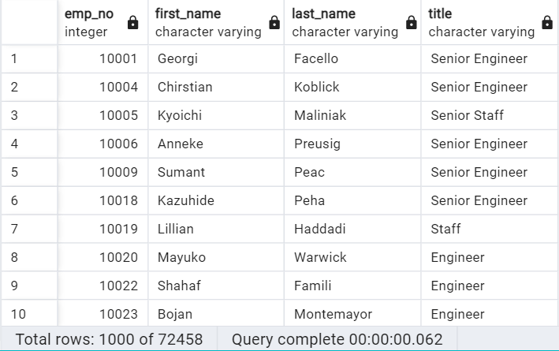
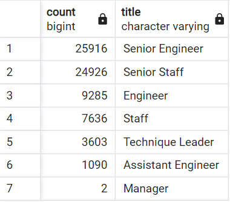
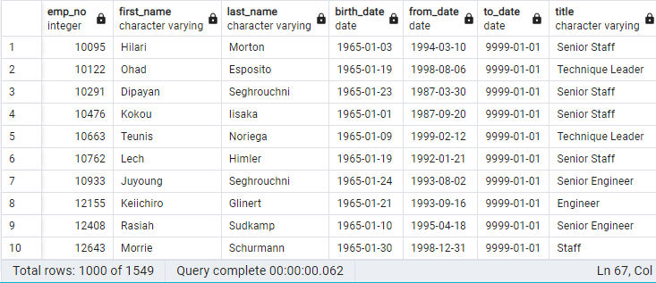

# Pewlett Hackard Analysis
Employee Database with SQL
## Analysis Overview
The purpose for this Pewlett Hackard Analysis is to determine the number of retiring employees by title and determine which employees are eligible for the mentorship program.

## Results
- ### Retiring Employees
    - The initial data analysis found that there are a total of 72,458 employees preparing to retire. See table below:
    

    - Aproximately 70%, or 50,842, of the retiring staff hold senior titles. 
    

    - 30%, 21,616, of the lower level titles are that of retiring employees.

    - 1549 retiring employees are eligible for the mentorship program.
    
## Summary
The results show that a grand total of 72,452 employees will be retiring around the same time. Based on the data from the mentorship eligibility table, there are not enough retirement-ready employees in the departments to mentor. An additional query shows that there are 738 senior level retirement-ready employees and 811 lower level staff that qualify for the mentorship program.